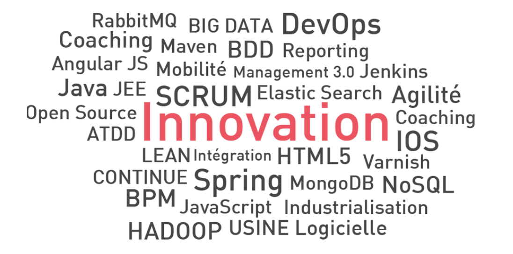
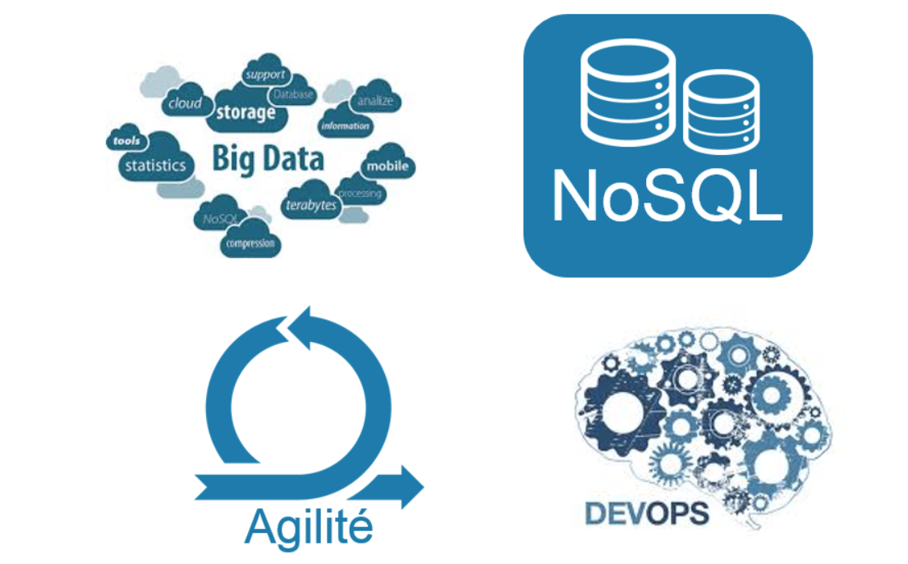
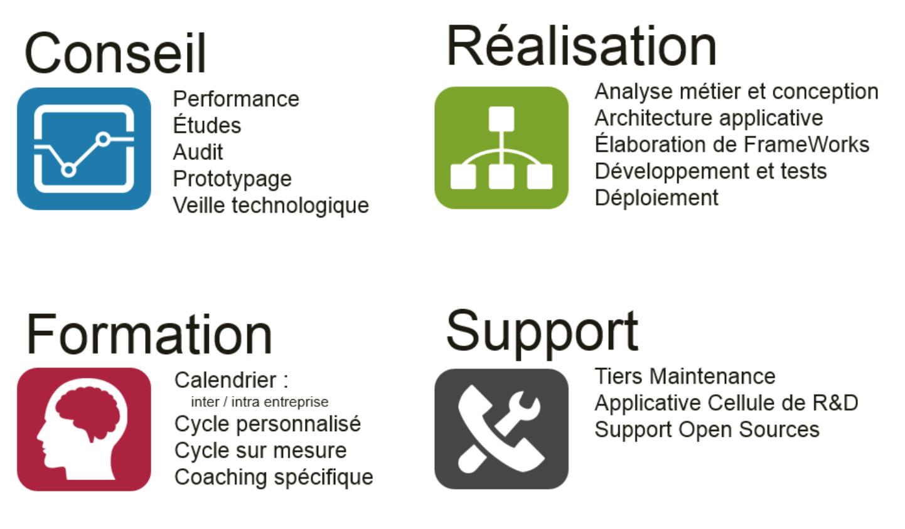
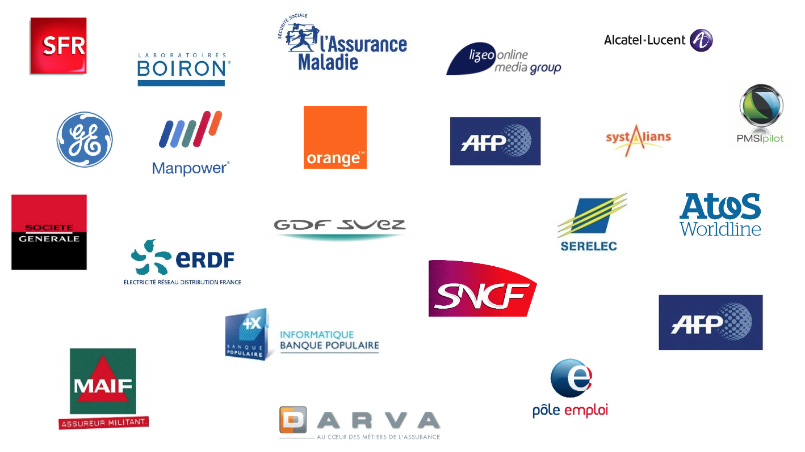
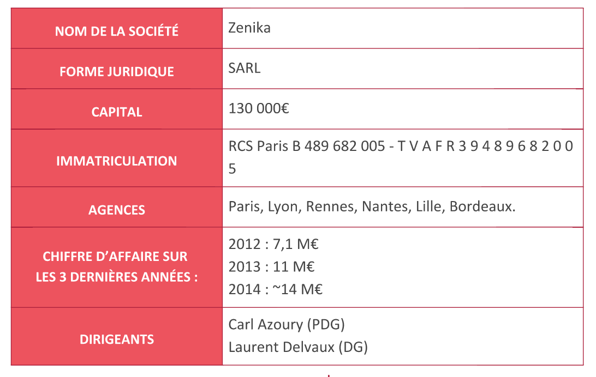

####Remerciement

##Introduction

##Presentation de l'entreprise
Zenika est un cabinet d'architecture informatique, spécialisé dans le conseil et la réalisation de solutions basées sur les nouvelles technologies, avec une très forte expertise de la plate-forme Java/JEE.
L' équipe de Zenika est constituée de professionnels expérimentés, évoluant 
au cœur des nouvelles technologies depuis plus de dix ans, et 
maîtrisant parfaitement les outils et les Frameworks les plus innovants. 
Zenika exige de ses consultants une triple compétence:

* Une capacité d’offrir du conseil et de la recommandation
* Une aptitude pour la réalisation et le terrain (tous les consultants sont ingénieurs et développeurs)
* Ainsi qu’une dimension de formateur et pédagogue.
Les architectes et les consultants Zenika conçoivent et réalisent principalement à partir de logiciels Open Source, des architectures logicielles adaptées à la taille et à l’enjeu des projets de nos clients.
  
Depuis l'expression des besoins utilisateurs jusqu’aux phases de recette, d’exploitation, et de maintenance, les  consultants vous proposent un suivi et un accompagnement personnalisés durant tout le cycle de vie du projet.

Grâce à ses fonctions supports de direction techniques et qualité, Zenika assure que tous les consultants qui vous seront confiés seront mentorés, encadrés et coachés par les meilleurs profils, mais que votre satisfaction restera au cœur des enjeux les plus importants.

####Spécialité de l'entreprise : l'innovation

Depuis sa création Zenika s’est positionné sur les domaines technologiques qui font l’informatique de demain. Ce choix stratégique permet à la fois :

 *  d’offrir des retours d’expérience, des formations, mais aussi de nombreux séminaires sur des domaines technologies de niches tout en conservant un positionnement sur les fondamentaux Java /JEE.
 
* de recruter de manière sélective afin de sélectionner les meilleurs profils aptes à mener des projets qui n’ont en jamais été.

Pour cela, la cellule de Direction Technique; ainsi que l’ensemble de la communauté Zenika, effectue une veille technologique active, et participe à de nombreuses contributions open-source.

####Les compétences de l'entreprise

Les compétences de l'entreprise s'articulent autour de  quatre grandes activités  :  **le conseil** , **la réalisation**, **la formation** et le **support**.

Les prinicipales domaines d'expertise de Zenika sont : 

 

Le  domaine d’expertise de Zenika va du Java débutant à Java spécialiste en passant par les nombreuses technologies de la boîte à outils java.

 

    

OpsDev est la vision DevOps de Zenika : une évolution culturelle du service informatique qui encourage la communication et la collaboration entre les équipes d’opérationnels (les Ops) et de développeurs 
(les Devs), mais aussi les autres services (QA, DBA, Archi, Fonctionnels, Marketing, Commercial...), dans le but de fournir des applications de meilleure qualité, plus fiable et répondant aux objectifs de la société.
Cette vision est l’extension logique de l’agilité à toute la chaîne de production des services informatiques.
Fort de son expérience agile et de son expertise technique tout autant Dev que Ops, Zenika propose de vous aider à construire votre démarche DevOps.
 

    
 
Alors que les projets confiés à la DSI sont toujours plus complexes, les approches prédictives historiques semblent toujours incapables d'y répondre.

De leur coté, les pratiques Agile permettent une augmentation de la satisfaction et de la qualité, tout en entraînant une réduction des délais et des coûts.  

 

     

Le Craftsmanship, c’est quoi ?
« Le problème avec le "vite et sale", c'est que le "sale" demeure bien longtemps après que le "vite" ait été oublié. » - Steve McConnell

Apprenez à mettre votre code sous contôle, industrialisez votre environnement de travail, découvrez comment écrire du code de qualité. S’initier au craftsmanship n’est pas seulement une affaire d’experts, c’est aussi une affaire de passion.  Zenika en fait  son ADN.
 

    

La programmation ne se limite pas au backoffice. Zenika vous propose un pôle d’expertise complémentaire tourné front office tant sur des écrans génériques que sur des écrans mobiles.
 

 

    

Allez au-delà de la business intelligence et développez vos outils décisionnels. A l’état de projet ou besoin de support, quel que soit le type de solution (colonnes, documents, clés/valeurs ou graph), nos experts peuvent vous apporter leur contribution.
  

Zenika vous proposent du conseil, de la réalisation ou de la formation sur les technologies les plus performantes et innovantes.

#### Zenika et La formation 
  Zenika Training est un centre de formation agréé. Zenika profite de l'expertise de ses consultants pour faire monter en compétences à de nombreux développeurs  sur toutes les technologies Open Source et les méthodes agiles.  
  
  La formation constitue 25% des chiffres d'affaires. Aujourd'hui,  Zenika 
  présente :
  
  * Plus de 100 formations au catalogue
  * Plus de 15 formations officielles et certifiantes
  * Un important réseau de partenaires
   
### Les valeurs de l'entreprise 

 Zenika a été créé sur le modèle de l'entreprise dans laquelle les dirigeants    aiméraient être lorsque qu'ils étaient consultants : Une communauté d'experts partageant des valeurs humaines et techniques suivantes : **Transparence** ,  **Partage**  et  **Convivialité**  

    

Les collaborateurs sont tenus informés des toutes les nouveautés et décisions stratégiques que prennent les dirigeants. La transparence est la clé de la confiance que portent les collaborateurs en Zenika 

 

     
Conférences Open Source, animations internes, tables rondes... sont autant d'occasions de partager vos connaissances techniques mais aussi vos idées, vos hobbies. Zenika vous donne la parole prenez-la !

 

    
Réunions informelles, soirées thématiques, bubbles... chaque occasion est propice aux échanges conviviaux.

 
 
###Presentation de Zenika Lille

L'agence Zenika Lille  a été créée début septembre 2014. Actuellement il compte huit collaborateurs et d'ici la fin de l'année 2015 l'effectif  évoluera jusqu'à douze ou treize.

Il est dirigé par le chef d'agence <a href="https://fr.linkedin.com/in/arnaudbuisine">Arnaud Buisine</a>. 
Il est secondé par un directeur technique <a href="https://fr.linkedin.com/in/gwennaelbuchet">Gwennäel Buchet</a>
####Les partenaires de l'entreprise

####Zenika : Fiche de présentation détaillée

## Presentation du travail
### Presentation du sujet
L'intitulé de mon sujet de stage : **Conception et développement d'une plateforme multicanale orientée micro services**

####Définition des mots-clés du sujet.
>> * **Plateforme Multicanale** :  C'est un service qui est utilisable à travers différents canaux. En informatique, une plateforme est multicanale si elle est supportée par les differents  types d'appareils existants : Ecrans d'ordinateur, de smartphones, de montres connectées etc....

>> * **Micro Services** :  Un Microservice est une forme de développement d'applications dans laquelle l'application est construite comme une suite de services . Les services sont indépendamment déployables et évolutives et peuvent être gérés par différents aspects d'une équipe de développement .

En résumé donc, le sujet peut être reformulé comme le  développement d'une application qui peut être utilisée par différents appareils et qui composée d'une suite de services indépendamment déployables.
### Le but du stage 
L'objectif de ce stage est de créer une plateforme multicanale à composantes, création de services en composition via interface web.

L'idée c'est de permettre à l'utilisateur de simplement faire du plug and play sur les différents composants qui lui sont fournis par l'interface Web pour faire fonctionner son service Web. Il n'a besoin pas  de savoir ce qui se passe derrière; les ressources sont générées à la volée.  

Les ressources n'existent qu'en mémoire. Ce qui présente plusieurs avantages.  

D'abord cela allège  beaucoup la taille du projet. Il y a plusieurs classes utilisées par le projet qui ne sont  pas sur fichier.  

 L'autre avantage  à retenir et qui a motivé la création de ce projet, c'est de pouvoir  décider à chaque instant , de quelles ressources nous pouvons mettre en marche. Ainsi cette ressource ou ces ressources seront générées en runtime. Et pour cela, il suffit juste de selectionner sur la liste des ressources présentées par l'interface Web  et elles sont créées.
 
 De plus nous pouvons décharger des ressources et en charger d'autres.

Nous voulions même aller plus loin, en voulant modifier les ressources déjà déployées en y ajoutant d'autres fonctions  mais les limites technologies nous ont freiné. Mais une fois que le projet sera mis   en Open-Source, cette question sera  ouverte à la communauté.

Ces ressources sont générées à partir d'une configuration qui est stockée dans une base de données. Cette configuration contient toutes les methodes
et les workflows dont ces methodes font appellent. Et les composants utilisés dans ces workflows sont stockés dans des fichiers jar.
 
 Le problème le plus délicat est qu'il y a possibilité que dans une configuration la sortie  d'un composant soit  l'entrée d'un autre composant.  
 Par exemple un composant peut être un  DAO (Objets d'accés aux données) et les données qui  sortent  de ce DAO sont utilisées par un autre composant-service. 

L'opportunité de créer de pouvoir générer des resources nous  permet de créer une plateforme multicanale. En effet, avec cette génération de ressources, nous pouvons filtrer la sortie des ressources pour l'adapter au type de canal que nous voulons. Par exemple, si  la sortie du DAO est une table avec plusieurs attributs, nous pouvons selectionner les attributs  et l'adapter au type de canal. 
Ceci nous  permet de faire   des applications multicanales. 

Supposons qu'il s'agit d'un composant DAO (Objets d'accés aux données). Nous pouvons utiliser un service-composant qui est un filtre pour filtrer les données qui proviennent du DAO . Nous pouvons décider alors de quels attributs des données nous aurons besoin pour pouvoir l'afficher. Ainsi cet affichage pourra être utilisé pour adapter l'application au type de sorties (mobile, ordinateur etc...).

### Le contexte 
Zenika Nord étant créé en début Septembre 2014, il n'avait pas encore de locaux jusqu'au début de mon stage en mars 2015. De ce fait des bureaux temporaires ont été loués jusqu'au debut Août 2015, période à laquelle Zenika Nord a réceptionné ces  nouveaux locaux. J'étais toujours entourés par les collaborateurs  qui n'étaient pas en mission chez le client. Ces collaborateurs sont tous experts dans leur domaine. N'oublions pas que Zenika est un cabinet d'expertise. 
J'ai pu profité de leur expertises pendant toute la durée de mon stage. 
  
   
 
 
 Concernant l'encadrement, j'étais sous la tutelle du directeur technique de Zenika Nord , Gwennäel BUCHET. Nous organisions des rendez-vous hebdomadaires dans lequels nous faisions le point sur l'avancement du projet.
 
 
 Au cours de chacun de ces rendez-vous, nous procédions aux  rectificatifs sur ce qui  était fait et nous définissions les perspectives à venir.
### Les aspects technologiques
Durant ce stage j'ai eu l'occaion de pratiquer une large palette de technologies. Des technologies qui sont fortement appréciées par le monde des développeurs. Nous pouvons en citer : 

 

<a href=http://jboss-javassist.github.io/javassist/>Javassist</a>   (Java programming assistant ) rend la manipulation de bytecode Java simple. C' est une bibliothèque  pour l'édition de bytecode en Java ; elle permet aux programmes Java de  définir une nouvelle classe à l'exécution et de modifier une classe lorsque la JVM le charge .  l'API  Javassist offre deux niveaux : le niveau  code  source et le  niveau  bytecode . Si l'API est utilisé  au niveau source , nous  peuvons modifier un fichier  code source d'une classe sans connaître les spécifications du bytecode Java . L' API est conçu avec seulement le vocabulaire du langage Java . Vous pouvez même spécifier le bytecode  sous la forme d'un texte source et Javassist le compile à la volée . D'autre part , l' API au niveau  bytecode permet aux utilisateurs d'éditer directement un fichier de classe  .
 
 

 

<a href=https://spring.io//>Spring</a>  est le framework de développement d'applications le plus populaire pour  Java entreprises. Des millions de développeurs dans le monde utilisent Spring Framework pour créer du performant , facilement vérifiable , réutilisable code. 
 
Spring Framework  est une plate-forme Java open source et il a été initialement écrit par Rod Johnson et a d'abord été publié sous la licence Apache 2.0 en Juin de 2003.
 
Spring est léger par la taille. La version de base de Spring Framework  est d'environ 2MB .
 
Les principaux éléments de Spring Framework peuvent être utilisés dans le développement de toute application Java, mais il existe des extensions pour construire des applications web au dessus de la plate-forme Java EE . Les objectifs de Spring Framework est de faciliter  le  développement d'applications J2EE  et promouvoir les bonnes pratiques de programmation en permettant un modèle de programmation basé sur les  POJO .

 

 

 Techniquement, les services REST sont spécifiés par le JCP (Java Community Process) sous le nom JAX-RS. Cette spécification précise ce que peut ou doit faire une implémentation, comme pour toutes ces spécifications. L'implémentation de référence que l'on utilise est <a href=https://jersey.java.net/>Jersey</a>. Jersey est installé en standard dans un serveur JEE (tel que Glassfish ou JBoss), et peut s'installer dans un serveur Tomcat.

 
 

 

<a href=https://jersey.java.net/>MongoDB</a> est un système de base de données dans la mouvance NoSQL. Il est orienté documents. Son nom vient de Humongous qui veut dire énorme ou immense. L'objectif est donc de pouvoir gérer de grandes quantités de données. Comment ? Le moteur de base de données facilite l'extension (on parle de scaling) si bien que l'on pourra supporter l'accroissement de la quantité de données par l'ajout de machines.

 
 

 

<a href=https://jersey.java.net/>AngularJS</a>
est un framework javascript qui permet de créer des application web dynamiques. Ce type d'applications (souvent appellées SPA pour 
Single Page Application) sont de plus en plus présentes avec des périphériques connectés de plus en plus variés.  Malheureusement, créer une application tenant sur une seule page n'est pas chose simple. En effet, cela requiert l'utilisation de beaucoup de javascript et il est très difficile de bien s'organiser et d'obtenir une application maintenable et modulable. Et c'est ici qu'AngularJS intervient.

### Le bilan 
Le bilan du projet est plutôt positif.  Nous avons entièrement développé toute la partie back-end du projet. Par contre, nous avons pas siffusamment pour avancer sur la partie Front-End. D'ailleurs cela fait partie des perpectives de ce projet. Nous en parlerons sur la partie perspective.
D'abord ce projet nous a permis d'avoir des réponses sur les questions que nous nous posions au début du projet. Pour ce faire, nous avions au tout début du projet préférer vérifier la faisabilité du projet.
#### Vérification la faisaibilité du projet.
Avant de se lancer et se rendre trois mois plus tard que le projet n'était pas faisable, nous avions jugé important de vérifier la faisaibilité au niveau technologies de projet. 

Ainsi il y avait trois difficultés majeures que nous devions surmonter . Nous avons décidé de les appeler des challenges pour qu'elles ne soient pas des obstacles pour nous.  Les principales questions posées étaient : 

* Est il possible de générer des ressources à la volée ?
* Etant donné que le serveur était déjà démarré, Est il possible de loader ces ressources générées avec Jersey?  
*  Spring pourrait il re-scanner ces ressources générées ?

 Nous avons créé pour chaque difficulté un **poc** pour tester avec quelle technologie nous pouvions la surmonter.

Un **poc** ( Proof of concept en anglais ) est étape de validation concrète dans la mise en place d'un projet radicalement nouveau.   C'est un projet jetable destiner  à mesurer la faisabilité et le niveau de difficulté du projet.

Ces pocs nous ont permis d'avoir des solutions techniques aux problèmes posés.

Pour la première difficulté, nous avons trouvé aprés moult recherches <a href=http://jboss-javassist.github.io/javassist/>Javassist</a> qui est un Framework qui permet de générer des classes et permet aussi d'ajouter des annotations à ces classes. Donc cela resolvait notre probléme car une resource n'est rien d'autre qu'une classe avec des annotations.

Pour la deuxième difficulté, nous avons découvert qu'il suffisait juste d'utiliser la fonction **register** de Jersey  dans une methode avec l'annotation **@PostContruct** pour  que Jersey reconnait la nouvelle resource générée.

Il s'est trouvé que nous avions même pas  besoin de rescanner les ressources pour que Spring puisse prendre en compte la nouvelle ressource. Il suffisait qu'elle soit générée et registrée pour que Spring le reconnait.

Une fois ces difficultés surmontées, il ne restait plus qu'à développer le projet.  Ainsi nous avons commencé par un projet mono-modulaire. Au fur et à mesure de l'avancement du projet nous l'avons decomposé en plusieurs modules pour rendre le code le plus réutilisable possible.

Cette modularité permet aussi à l'utilisateur de choisir la base de données et le serveur avec lesquels il veut travailler. Pour l'instant, nous utilisons  la base de données MongoDB et le serveur web Jersey mais l'architecture du projet est organisée de façon que nous pouvons ajouter d'autres bases de données et  d'autres serveurs Web.

###  Les perspectives.
Les perspectives à moyens termes du projet est de développer le Front-End avec AngularJS.  Tous les services web sont déjà en place pour permettre l'ajout d'un module Front-End à ce projet. 

Quand nous commencions ce projet, l'idée était d'en faire un  projet Open-Source. Ce qui fait que si ce projet est à terme il sera ouvert  à Zenika et ensuite à l'extérieur. De ce fait beaucoup d'expertises pourront conquérir pour rendre ce projet le plus viable possible.
##Le bilan personnel du stage.
Personnellement ce stage pour moi d'un intérêt incommensurable. Allant à la découverte du milieu professionel à la montée en compétence sur des technologies comme java, Spring, mongoDB.

####Découverte du milieu professionnel.
Dans ce stage, j'ai eu la chance  d'attérir dans ce qu'on appelle les entreprises libérées. Dans les entreprises informatiques, il en existe que trois ou quatre : *Octo*, *SFEIR*, *XEBIA* et *ZENIKA*. Dans ces types de sociétés c'est le collaborateur qui est le centre d'intêret. Les collaborateurs sont assciés à toute prise de décision. 

C'est ainsi  que j'étais associé à beaucoup de prise de décisions, à l'organisations d'événement. J'ai été co-organisateur d'une soirée d'agence de Zenika Lille dans laquelle les deux dirigeants étaient présents.

De plus, beaucoup d'événement sont organisés dans lesquels tu as l'occasion de rencontrer d'autres collaborateurs qui sont experts dans leurs domaines respectives et des échanges fructueuse naissent souvent de ces rencontres. 
Ces échanges permettent aux collaborateurs de monter en compétences dans leurs domaines d'expertises respectives.

Il y a aussi des rencontres qui sont organisées tous les six mois pour favoriser le rapprochement des collaborateurs  de toutes les agences de  Zenika. C'est ainsi que j'ai eu l'occasion   de passer de bons moments avec une grande partie l'équipe Zenika au club Med Opio en Juin 2015. Un autre Week End est prévu mi-septembre à Saint Malo. 

####Monter en compétence sur les technologies 
Durant ce stage, j'ai eu a utiliser beaucoup une certain nombre de technologies allant de Java à Spring en passant par Jersey.

D'abord cela m'a permis de découvrir un  Framework Java que je ne connaissait, <a href=http://jboss-javassist.github.io/javassist/>Javassist</a>. J'ai appris à le manipuler pour pouvoir générer des classes en runtime.
L'apprentissage a été un peu délicat, parce que la documentation sur le site officiel n'est pas bein explicite. Etant donné que les classes sont générées à la volée,  c'était difficile de le débugger. 

J'avais déjà utilisé  Spring et Jersey avant mais c'est ce stage qui m'a permis de bien comprendre leur architecture, d'avoir une vision beaucoup plus approfondie sur leur mode de  fonctionnement.

Ce stage m'a aussi permis de savoir que la seule valeur qui peut faire vendre dans le milieu professionnel c'est d'être expert dans les technologies que tu préfères. Depuis, j'essaie toujours de m'auto-former sur les technologies dans lesqelles j'aime évoluer.

##Conclusion

Cette expérience m'a permis de bien intégré le milieu professionnel.
